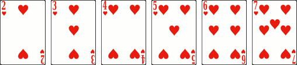

# Littérature

> Source : [Littérature](https://jeuxdecartes1.e-monsite.com/pages/jeux-de-familles/litterature.html)

♦ **Matériel** : Un jeu de 52 cartes (sans Joker) duquel on retire les 8

♦ **Nombre de joueurs** : En deux équipes de 3 ou 4 joueurs (c’est-à-dire à 6 ou 8 joueurs)

♦ **Objectif** : Réunir plus de suites que l’équipe adverse

♦ **Nombre de cartes pour chaque joueur** : Toutes les cartes sont distribuées équitablement

♦ **Règle du jeu** : ***Littérature***, parfois appelé ***Canadian Fish***, en référence au [***Go Fish***](http://jeuxdecartes1.e-monsite.com/pages/jeux-de-familles/le-go-fish.html), est un jeu de stratégie et de mémoire dont les origines sont peu connues. Les joueurs sont divisés en deux équipes, assis alternativement, et les 48 cartes sont équitablement distribuées entre eux. Celles-ci sont divisées en 8 suites :

- Les ***petites suites***, constituées des ***2***, ***3***, ***4***, ***5***, ***6*** et ***7*** d’une même couleur :

- Les ***grandes suites***, constituées des ***9***, ***10***, ***Valet***, ***Dame***, ***Roi*** et ***As*** d’une même couleur :

À son tour de jeu, un joueur demande une carte précise à un joueur de ***l’équipe adverse*** ; il ne peut demander une carte que s’il possède au moins une carte de cette suite dans son jeu et qu’il ne possède pas lui-même la carte qu’il demande ; il est par ailleurs interdit de demander une carte à un joueur de son équipe. Si le joueur interrogé possède cette carte, il la lui passe, et le joueur rejoue (de nouveau, il peut demander une carte à n’importe quel joueur de l’équipe adverse) ; sinon, la main passe au joueur ayant été interrogé. Lorsqu’un joueur a collecté les six cartes d’une suite, il fait une ***revendication*** : il la pose face visible devant lui et fait marquer un point à son équipe. Le jeu continue jusqu’à ce que toutes les suites aient été revendiquées, l’équipe gagnante étant celle qui en a collecté le plus.

Si une suite est éparpillée entre les joueurs d’une même équipe, un joueur peut faire une revendication quand vient son tour de jeu en annonçant correctement quel joueur de son équipe a quelle carte de cette suite (il peut lui-même n’avoir aucune carte de cette suite dans son jeu) ; par exemple : « *Petite suite à cœur, j’ai le 2 et le 3, Lucie a le 5 et Lucas, les 4, 6 et 7.* » Ainsi, tous les joueurs en possession de cartes de cette suite montrent leurs cartes. Si le joueur n’a pas entièrement juste dans la répartition des cartes, mais que la suite est entièrement dans les mains de son équipe, la suite n’est plus valable et aucune des deux équipes ne peut plus la remporter. Cependant, si au moins l’une des cartes de cette suite est détenue par un joueur de l’équipe adverse, la suite revient à l’autre équipe. Après que la revendication est résolue, le tour du joueur continue.

Un joueur n’ayant plus de cartes en main ne peut plus formuler de demandes : son tour de jeu est révoqué. Ainsi, après une revendication, si le joueur dont c’est le tour n’a plus de cartes en main, celui-ci donne son tour à l’un de ses coéquipiers ayant encore des cartes en main. Enfin, lorsqu’une équipe est à court de cartes, plus aucune question ne peut être posée : si le tour est à un joueur de l’équipe ayant encore des cartes, celui-ci doit déterminer dans toutes les suites restantes, et sans consultation de ses coéquipiers, quel joueur de son équipe a quelle carte. Si, au contraire, le tour est à un joueur de l’équipe n’ayant plus de cartes, celui-ci choisit le joueur de l’équipe adverse qui devra revendiquer les dernières suites ; le joueur choisi doit avoir au moins une carte en main.
