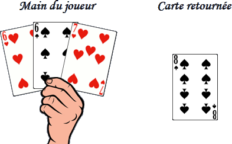

# Noddy

> Source : [Noddy](https://jeuxdecartes1.e-monsite.com/pages/jeux-d-addition/noddy.html)

♦ **Matériel** : Un jeu de 52 cartes (sans Joker)

♦ **Nombre de joueurs** : À 2 joueurs

♦ **Objectif** : Gagner des points en réalisant des combinaisons de cartes

♦ **Nombre de cartes pour chaque joueur** : 3 cartes

♦ **Valeur des cartes, de la plus faible à la plus forte** : As – 2 – 3 – 4 – 5 – 6 – 7 – 8 – 9 – 10 – Valet – Dame – Roi

♦ **Règle du jeu** : ***Noddy*** (c’est le nom donné au Valet dans la couleur d’atout) est l’ancêtre du ***Cribbage ***moderne. Un joueur distribue 3 cartes à chaque joueur, face cachée, pose le reste des cartes au centre et retourne à côté la première carte, qui définit la couleur d’atout. À partir des 3 cartes qu’ils ont en main et de la carte retournée (qui fait office de quatrième carte), les deux joueurs consignent toutes les combinaisons qu’ils peuvent faire et précisent, pour chacune, les points engrangés. Les combinaisons possibles sont les suivantes :

- **Noddy** (Valet dans la couleur d’atout) : 1 point (2 points pour le joueur n’ayant pas distribué si Noddy est la carte retournée)
- **Quinze** (2 cartes ou plus totalisant 15) : 2 points
- **Vingt-cinq** (3 cartes ou plus totalisant 25) : 1 point par carte constituante
- **Trente-et-un** ou **Hitter** (4 cartes ou plus totalisant 31) : 1 point par carte constituante
- **Paire** (2 cartes de même valeur) : 2 points
- **Paire royale** (3 cartes de même valeur) : 6 points
- **Double paire royale** (4 cartes de même valeur) : 12 points
- **Suite de 3 cartes** : 2 points
- **Suite de 4 cartes** : 4 points
- **Suite de 5 cartes** : 1 point par carte constituante (cette combinaison ne peut être réalisée que dans la phase « jeu »)
- **Couleur* ***(3 cartes ou plus d’une même couleur) : 1 point par carte constituante

Les cartes de l’As au 10 comptent de 1 à 10 et les figures valent toutes 10 (l’As est donc la carte la plus faible).

Les annonces : Chacun son tour, en commençant par le joueur n’ayant pas distribué, annonce à son adversaire, sans les montrer, les combinaisons réalisées et donne le cumul des points au fur et à mesure de leur énumération. Toute carte individuelle peut être comptée plus d’une fois à condition qu’elle fasse partie d’une combinaison distincte à chaque fois :

Quatre combinaisons :

- **Quinze** (2 points) : 7 + 8
- **Paire** (2 points) : ♥6 et ♠6
- **Suite de 3 cartes** (2 points) : ♥6 – ♥7 – ♠8
- **Suite de 3 cartes** (2 points) : ♠6 – ♥7 – ♠8

Pour son annonce, le joueur dit à son adversaire : « *J’ai un quinze pour 2 points, une paire pour 4 points, une suite de 3 cartes pour 6 points et une autre suite de 3 cartes pour 8 points.* »

Le jeu : Après avoir écarté la carte retournée, le joueur n’ayant pas distribué pose une carte de sa main, face visible, et annonce sa valeur numérique. Ensuite, chaque joueur pose une carte de sa main et annonce le ***total cumulé*** de toutes les cartes jouées. Chaque fois qu’une carte jouée crée une combinaison avec la ou les cartes qui lui précédent immédiatement, le joueur ayant posé la dernière carte renseigne la combinaison sur sa fiche de jeu et actualise son total de points, son objectif étant d’accumuler le maximum de points.

Lorsqu’un joueur ne peut jouer sans dépasser*** 31***, il s’écrie « ***Go !*** » ; son adversaire, s’il le peut, continue de jouer seul. Si un joueur fait exactement 31, il marque 2 points supplémentaires. En revanche, si les 31 ne sont pas atteints, le dernier joueur à avoir joué marque 1 point supplémentaire. Le gagnant est le joueur ayant totalisé le plus de points (grâce aux combinaisons) une fois que les 31 ont été atteints ou qu’aucun des joueurs ne peut plus jouer sans dépasser 31. Les cartes non jouées ne sont pas comptabilisées.
