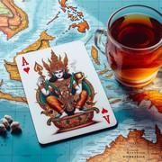

# Omben

> Source : [Omben](https://jeuxdecartes1.e-monsite.com/pages/jeux-de-familles/omben.html)

♦ **Matériel** : Un jeu de 52 cartes (sans Joker)

♦ **Nombre de joueurs** : À 2 joueurs

♦ **Objectif** : Être le premier à se débarrasser de toutes ses cartes en formant des carrés

♦ **Nombre de cartes pour chaque joueur** : 4 ou 5 cartes

♦ **Règle du jeu** : ***Omben***, aussi connu sous le nom javanais ***Minuman ***(les deux mots signifiant « ***boire*** »), est un jeu de cartes indonésien. En début de partie, les deux joueurs en compétition s’accordent sur le nombre de cartes à se distribuer : 4 ou 5 cartes. Le reste des cartes forme la pioche.

Comme au [***Go Fish***](http://jeuxdecartes1.e-monsite.com/pages/jeux-de-familles/le-go-fish.html), chaque joueur, à son tour de jouer, doit former un ensemble de 4 cartes de même valeur – par exemple ♠4, ♣4, ♥4 et ♦4 –, carré de cartes qu’il dépose ensuite devant lui, face visible. Pour ce faire, il demande une valeur de carte à son adversaire :

1) Si son adversaire possède une ou plusieurs cartes de la valeur demandée, il doit toutes les lui donner.

2) Si son adversaire ne possède pas de carte de cette valeur, le joueur doit « ***boire*** », c’est-à-dire piocher, et ce, jusqu’à ce qu’il tombe sur une carte de la valeur souhaitée.

Une fois que la demande a trouvé satisfaction (grâce à l’adversaire ou grâce à la pioche), c’est au tour du joueur suivant.

Dès lors qu’un joueur récolte un carré de cartes de même valeur, il doit immédiatement le déposer devant lui. Le gagnant est le premier joueur à se débarrasser de toutes ses cartes, peu importe le nombre de combinaisons réalisées. Si la pioche s’épuise, le gagnant est le joueur ayant le moins de cartes dans sa main.
