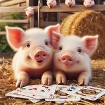

# Pig

> Source : [Pig](https://jeuxdecartes1.e-monsite.com/pages/jeux-de-passes-de-cartes/pig.html)

♦ **Matériel** : Un jeu de 52 cartes (sans Joker), et des cuillères dans la variante ***Spoons***

♦ **Nombre de joueurs** : Entre 3 et 13 joueurs

♦ **Objectif** : Former un carré, c’est-à-dire réunir quatre cartes de même valeur dans sa main

♦ **Nombre de cartes pour chaque joueur** : 4 cartes

♦ **Règle du jeu** : ***Pig*** (qui veut dire ***Cochon***) est un jeu pour enfants qui a vu le jour aux États-Unis, au début du XXe siècle. On conserve autant de carrés de cartes qu’il y a de joueurs ; par exemple, 5 joueurs utiliseront les As, les Rois, les Dames, les Valets et les 10. Après mélange, chacun reçoit donc 4 cartes.

Assis en cercle, les joueurs placent simultanément une carte indésirable, face cachée, à leur gauche, et ramassent la carte placée par le joueur à leur droite ; ils réitèrent ce mouvement jusqu’à ce qu’un joueur obtienne un carré (quatre cartes de même valeur) dans sa main. Si la vitesse de passe est au choix des joueurs, les cartes doivent être transmises une par une, de sorte qu’un joueur n’est autorisé à ramasser la carte à sa droite qu’après avoir placé une de ses cartes à sa gauche.

Le premier à former un carré doit immédiatement toucher le bout de son nez avec son index. Dès lors qu’ils repèrent ce geste, les autres joueurs doivent l’imiter ; le dernier est éliminé. Pour la manche suivante, 4 cartes de même valeur sont retirées du jeu. Les deux derniers joueurs encore en jeu sont déclarés gagnants.

---

♦ **Variantes** :

1) En début de partie, les joueurs reçoivent 3 vies, chacune pouvant être représentée par une lettre du mot « PIG » : ainsi, un joueur se voit attribuer un « P » pour sa première défaite, un « I » pour sa deuxième défaite, et un « G » pour son élimination définitive.

2) Dans la variante ***Spoons***, des cuillères sont disposées au centre du cercle dessiné par les joueurs, à raison d’une cuillère de moins que le nombre de joueurs. Le premier à former un carré récupère une cuillère. Les autres joueurs doivent faire de même, c’est-à-dire récupérer une cuillère chacun. Le perdant est celui n’ayant pas réussi à en attraper une. Après chaque élimination, une cuillère et 4 cartes de même valeur sont retirées du jeu. Comme dans ***Pig***, un joueur peut être directement éliminé lorsqu’il perd ou bien bénéficier d’un sursis (si l’on joue avec *3 Vies*).

3) En 1946, Margaret Mulac décrit une variante du jeu, appelée ***Donkey***, dans laquelle les joueurs, plutôt que de poser leur index sur le nez, placent leurs mains de part et d’autre de leur tête pour imiter les oreilles d’un âne.
