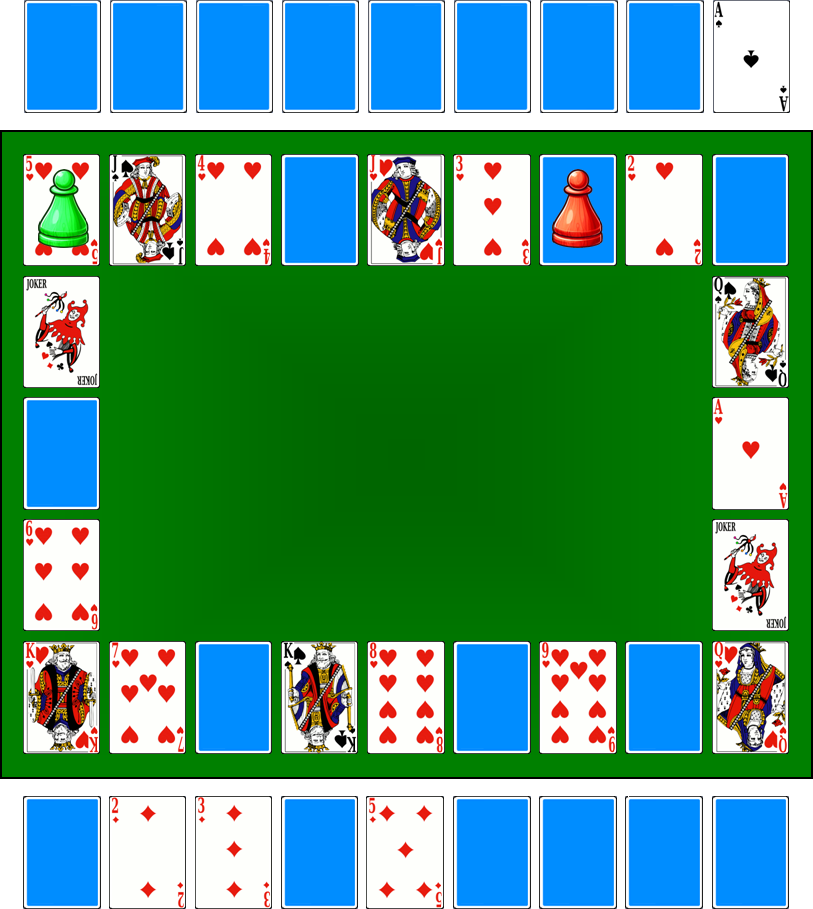

# Promenade

> Source : [Promenade](https://jeuxdecartes1.e-monsite.com/pages/jeux-de-course/promenade.html)

♦ **Matériel** : Un jeu de 52 cartes et 2 Jokers, un dé et des pions (deux jeux à partir de 4 joueurs)

♦ **Nombre de joueurs** : Entre 2 et 6 joueurs

♦ **Objectif** : Être le premier joueur à terminer sa cueillette

♦ **Règle du jeu** : Chaque joueur étale devant lui, face cachée, les cartes de l’As au 9 d’une même couleur — ♦, ♣ ou ♠ —, représentant les 9 fruits qu’il devra cueillir pendant sa promenade dans les bois. Les autres cartes constituent le plateau de jeu, comme ceci (avec deux joueurs), et les cartes non utilisées sont écartées :

Chaque joueur lance le dé à tour de rôle et avance son pion d’autant de cartes qu’indiqué. Lorsqu’un joueur tombe sur une carte-fruit (♥As, ♥2, ♥3, ♥4, ♥5, ♥6, ♥7, ♥8 ou ♥9), il retourne dans son jeu la carte de valeur correspondante ; si celle-ci est déjà visible, il la laisse telle quelle. Le premier joueur ayant ramassé les 9 fruits gagne la partie.

Avant de commencer, les pions sont rassemblés sur la carte ♥Dame, le pouvoir de cette carte ne prenant effet qu’au deuxième tour de jeu. Le jeu se joue dans le sens antihoraire.

Cartes spéciales :

- **♥****Dame**, **♥****Valet **et **♥****Roi (cartes « elfe »)**** **: les elfes vous donnent rendez-vous sur la carte-fruit souhaitée pour y cueillir un fruit.
- **♠Dame (carte « mauvaise fée ») **: mauvais sort ; passez votre prochain tour de jeu.
- **♠Valet (carte « lutin ») **: vol ; un lutin dérobe un fruit dans votre panier. Retournez face cachée l’une de vos cartes, au choix.
- **♠Roi (carte « troll ») **: obstacle ; un troll barre votre chemin. Faites un 5 ou un 6 pour passer l’embûche.
- **Joker (carte « bottes de sept lieues »)** : avancez d’autant de cartes.
