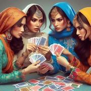

# Q Squared Joe NG

> Source : [Q Squared Joe NG](https://jeuxdecartes1.e-monsite.com/pages/jeux-de-combat/q-squared-joe-ng.html)

♦ **Matériel** : Un jeu de 52 cartes (sans Joker)

♦ **Nombre de joueurs** : Entre 2 et 4 joueurs

♦ **Objectif** : Éliminer son adversaire en attaquant ses cartes

♦ **Nombre de cartes pour chaque joueur** : 11 cartes

♦ **Valeur des cartes, de la plus faible à la plus forte** : As – 2 – 3 – 4 – 5 – 6 – 7 – 8 – 9 – 10 – Valet – Dame – Roi

♦ **Règle du jeu** : ***Q Squared Joe NG*** (NG signifiant ***New Game***) est un jeu de combat plus complexe que [***Q Squared Joe War***](http://jeuxdecartes1.e-monsite.com/pages/jeux-de-combat/q-squared-joe-war.html) utilisant également les règles du [***Q Squared Joe***](http://jeuxdecartes1.e-monsite.com/pages/jeux-d-appariemment/q-squared-joe.html) classique. Le jeu s’organise en 4 parties : la pile ressource, la main, la pioche et le terrain de jeu. Chaque joueur reçoit 5 cartes en main, 5 cartes face cachée qui composent son terrain de jeu, et une carte face visible qui constitue sa pile ressource. Les cartes restantes forment la pioche, commune à tous les joueurs. À son tour de jouer, le joueur choisit ***une seule*** des cinq options suivantes (il ne peut pas passer son tour) :

1) **Piocher** : Le joueur pioche une carte et l’ajoute à sa main.

2) **Prendre** : Le joueur prend une carte de sa pile ressource et l’ajoute à sa main.

3) **Se défendre** : Le joueur choisit une carte de sa main et la dispose face visible sur une carte de son terrain de jeu, au choix.

4) **Sacrifier **: Le joueur prend une carte de son terrain de jeu et l’ajoute à sa main. Dans le cas d’une carte défendue par une autre, seule la carte de défense (celle du dessus) peut être prise.

5)** Attaquer **: Le joueur peut attaquer seulement avec une carte de sa main. Après chaque attaque, la carte attaquante est jetée dans la pile de défausse si elle perd la bataille et intégrée à la pile ressource du joueur si elle gagne la bataille. Un joueur peut attaquer le domaine de jeu, la main ou la pile ressource d’un ennemi :

**La main** : Le joueur choisit au hasard, sans la regarder, une carte de la main d’un ennemi et l’attaque. Si sa carte est d’une valeur supérieure, la carte attaquée est envoyée dans la pile de défausse et sa carte est placée dans sa pile ressource. Dans le cas contraire, sa carte est envoyée dans la pile de défausse pendant que la carte attaquée reste dans la main du joueur ; s’il y a égalité, les deux cartes sont envoyées dans la pile de défausse.

**La pile ressource** : L’attaque concerne toutes les cartes simultanément ; ainsi, si une seule carte la vainc (ou égalise), la carte attaquante est immédiatement envoyée dans la pile de défausse. Les cartes qui ne sont pas vaincues restent dans la pile ressource tandis que les autres sont envoyées dans la pile de défausse ; une égalité engendre une perte des deux côtés.

**Le terrain de jeu** : C’est une ***attaque en chaîne***, c’est-à-dire que la carte attaque en priorité les cartes de défense sur le dessus, puis, chaque fois qu’elle vainc une carte, elle passe à la carte suivante, jusqu’à avoir vaincu toutes les cartes. Mais, comme les cartes du terrain de jeu sont disposées face cachée, il y a une chance que la carte attaquante ne gagne pas toutes les batailles. Ainsi, dès lors qu’une carte attaquante rencontre une carte plus forte, elle est envoyée dans la pile de défausse et la carte survivante est disposée face visible (si elle ne l’était pas déjà). En cas d’égalité, les deux cartes sont envoyées dans la pile de défausse, et l’attaque en chaîne se termine. En revanche, si la carte attaquante survit à la dernière attaque, elle est placée dans la pile ressource du joueur.

Dès lors que le terrain de jeu d’un joueur est vide, il est éliminé ; le gagnant est le dernier joueur encore en jeu.

---

♦** Variante** : Le jeu propose une variante plus stratégique consistant à jouer avec ***toutes les cartes visibles*** : les cartes que les joueurs ont en main, les cartes constituant le terrain de jeu et toutes les cartes de la pioche.
