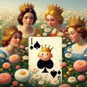

# Q Squared Joe

> Source : [Q Squared Joe](https://jeuxdecartes1.e-monsite.com/pages/jeux-d-appariemment/q-squared-joe.html)

♦ **Matériel** : Un jeu de 52 cartes (sans Joker)

♦ **Nombre de joueurs** : Entre 2 et 10 joueurs

♦ **Objectif** : Se débarrasser le premier de toutes ses cartes

♦ **Nombre de cartes pour chaque joueur** : 5 cartes

♦ **Valeur des cartes, de la plus faible à la plus forte **: As – 2 – 3 – 4 – 5 – 6 – 7 – 8 – 9 – 10 – Valet – Dame – Roi

♦ **Règle du jeu **: ***Q Squared Joe*** (ou ***Q²J***) est un jeu inventé en 2005 par un étudiant américain. Un joueur distribue 5 cartes à chaque joueur, face cachée, à l’exception de la dernière, qui reste face visible. Le reste des cartes est posé face cachée, constituant la pioche, et une carte est retournée à côté, constituant la défausse. Le joueur ayant devant lui la carte de plus grande valeur commence. En cas d’égalité, les joueurs impliqués retournent une seconde carte de leur jeu. Dès lors que le premier joueur est identifié, les joueurs prennent leurs 5 cartes en main. À son tour de jouer, ***chaque joueur doit jeter une carte plus forte que la carte du dessus de la pile de défausse***. Voici les règles de défausse :

1) Une carte de valeur supérieure est plus forte qu’une carte de valeur inférieure dans une autre couleur. Ainsi, le ♠Valet est plus fort que le ♥10 ou que le ♣4.

2) Une carte de valeur inférieure est plus forte qu’une carte de valeur plus élevée si elles sont de la même couleur. Ainsi, le ♣4 est plus fort que la ♣Dame et le ♥9 est plus fort que le ♥10.

3) Un As est plus fort que n’importe quelle figure. Ainsi, l’♥As est plus fort que la ♥Dame ou que le ♠Valet.

4) Les cartes de même valeur ont une force égale : s’il pose une carte de même valeur que la carte figurant sur la pile de défausse, le joueur doit piocher une nouvelle carte.

***   ***5) ***Règle du Q Squared (Carré de Dames)*** : Un joueur en possession de 2 Dames peut les jouer toutes les deux à son tour de jouer comme si elles ne formaient qu’une seule carte. Elles peuvent être posées sur n’importe quelle carte à l’exception d’un Valet ou d’une autre paire de Dames. Le joueur qui enchaîne doit ou jouer un Valet (***Joe***) ou piocher une nouvelle carte. S’il pioche, le joueur suivant doit également poser un Valet ou piocher, et ainsi de suite, jusqu’à ce que le tour de table soit achevé. Quand le tour revient au joueur du Q Squared, ce dernier continue avec une seule carte.

6) ***Règle de Joe ***: Le Valet est la seule carte pouvant être posée sur un Q Squared. Après qu’un joueur a posé un Valet sur un Q Squared, le jeu continue comme avant.

Si un joueur ne peut ou ne veut pas jouer, il doit piocher une carte et passer son tour. Si la pioche est épuisée, la pile de défausse est mélangée pour constituer une nouvelle pioche. Le gagnant est le premier joueur à se débarrasser de toutes ses cartes.
