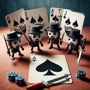

# Seven Spades

> Source : [Seven Spades](https://jeuxdecartes1.e-monsite.com/pages/jeux-de-pioche-defausse/seven-spades.html)

♦ **Matériel** : Un jeu de 52 cartes (sans Joker)

♦ **Nombre de joueurs** : À 2 joueurs (variante à 3, 4 ou 5 joueurs)

♦ **Objectif** : Aligner 7 cartes ♠ devant soi

♦ **Règle du jeu** : ***Seven Spades*** (qui veut dire ***Sept Piques***) est un jeu de bluff inventé par Johan Wästlund. Le paquet est mélangé et disposé face cachée entre les joueurs. À son tour de jouer, le joueur pioche une carte, la regarde et choisit entre deux options :

1) Il la jette dans la pile de défausse (à côté de la pioche).

2) Il prétend qu’il s’agit d’un ♠ et dispose la carte face cachée devant lui.

Les cartes revendiquées comme étant des ♠ forment une ligne devant chaque joueur et se chevauchent légèrement ; en effet, son adversaire doit savoir à tout instant le nombre de cartes disposées devant lui et l’ordre dans lequel elles ont été revendiquées.

Le challenge : À son tour de jeu, un joueur peut contester ***la dernière carte*** revendiquée par son adversaire : pour ce faire, il retourne cette carte. Si ce n’est pas un ♠, il gagne la partie, tandis que s’il s’agit d’un ♠, c’est le joueur ayant revendiqué cette carte qui gagne. D’une façon ou d’une autre, le challenge clôt la partie.

S’il n’y pas de challenge, le premier joueur ayant revendiqué et aligné sept cartes est déclaré vainqueur. À noter : un joueur qui revendique sa septième carte doit la poser face visible au-dessus des six autres, et ce doit être un ♠ ; il n’y a donc pas de contestation possible pour cette dernière carte.

---

♦ **Variante** : En diminuant le nombre de cartes à revendiquer pour remporter la partie, le jeu peut se jouer à 3 joueurs (5 cartes à revendiquer), à 4 joueurs (4 cartes à revendiquer) ou à 5 joueurs (3 cartes à revendiquer).
