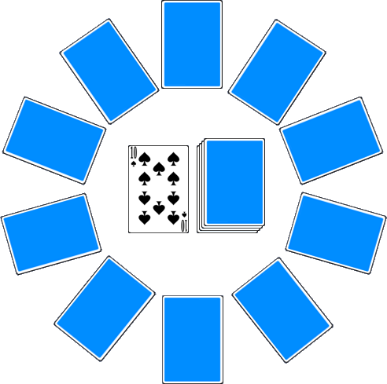

# Shamus

> Source : [Shamus](https://jeuxdecartes1.e-monsite.com/pages/jeux-divers/shamus.html)

♦ **Matériel** : Un jeu de 52 cartes (sans Joker)

♦ **Nombre de joueurs** : À 2 joueurs (variante à 4 joueurs)

♦ **Objectif** : Se débarrasser de toutes ses cartes ou constituer des combinaisons de cartes pour vaincre Shamus Senior ou Shamus Junior

♦ **Nombre de cartes pour chaque joueur** : 6 cartes

♦ **Valeur des cartes, de la plus faible à la plus forte** : As – 2 – 3 – 4 – 5 – 6 – 7 – 8 – 9 – 10 – Valet – Dame – Roi

♦ **Règle du jeu** : ***Shamus*** est un jeu coopératif probablement originaire d’Irlande. D’abord, le donneur distribue 6 cartes, une par une, à chaque joueur ; il représente ensuite le ***cercle de Shamus*** en disposant 10 cartes en rond, face cachée, dans le sens horaire (ce cercle est utilisé pendant le jeu pour compter le nombre de tours restant à jouer) ; la carte suivante est retournée, fondement de la pile défausse et le reste du paquet, constituant la pioche, est posé à côté (si la première carte retournée est un 2 ou un 4, le joueur qui commence doit piocher le nombre de cartes correspondant (2 ou 4) et passer son tour, c’est-à-dire qu’il ne touche pas aux cartes du cercle de Shamus). Voici la disposition en début de jeu (la pioche et la défausse peuvent être également à l’extérieur du cercle) :

L’objectif des joueurs est de vaincre ***Shamus Senior*** ou, à défaut, ***Shamus Junior*** :

- Pour vaincre Shamus Senior, le donneur doit ***se défausser de toutes les cartes de sa main*** (comme au ***Uno***) et son coéquipier doit obtenir un total minimum de ***50 points*** en réalisant des combinaisons (comme au ***[Rami](https://jeuxdecartes1.e-monsite.com/pages/jeux-de-pioche-defausse/le-rami.html)***), le tout, avant que la dernière carte du cercle de Shamus n’ait été jetée ;
- Pour vaincre Shamus Junior, le joueur de Rami doit totaliser un minimum de ***100 points et se défausser de toutes les cartes de sa main*** (sa dernière carte devant être jetée dans la pile de défausse), le tout, avant que la dernière carte du cercle de Shamus n’ait été jetée.

Si, à tout moment, le nombre de cartes que le joueur de Uno a en main dépasse le nombre de cartes du cercle de Shamus, Shamus Senior ne pourra plus être vaincu ; il faudra donc tenter de battre Shamus Junior.

Le déroulement du jeu :

1) Le joueur de Uno : C’est le donneur et c’est lui qui commence. Comme au Uno, célèbre adaptation du ***[8 Américain](https://jeuxdecartes1.e-monsite.com/pages/jeux-d-appariemment/le-8-americain.html)***, le joueur doit se défausser d’une carte de même valeur ou de même couleur que la première carte de la pile de défausse. Si aucune correspondance n’est possible – et seulement dans ce cas –, il doit tirer des cartes de la pioche jusqu’à ce qu’il puisse jouer. Enfin, lorsqu’il ne lui reste qu’une carte en main, il doit avertir son coéquipier en annonçant *« **Uno !** »*.

Attention aux cartes à pouvoir : les ***2*** (comme les cartes « +2 » au Uno) l’obligent à piocher deux cartes et à passer son tour ; les ***4*** (un peu comme les cartes « +4 » au Uno) l’obligent à piocher quatre cartes et à passer son tour ; les ***As*** (comme les cartes « Joker » au Uno) peuvent être joués sur n’importe quelle carte et lui permettent de choisir la couleur à jouer s’ils sont jetés par son coéquipier (en revanche, ils n’ont aucun pouvoir lorsqu’ils sont jetés depuis le cercle de Shamus).

Après s’être défaussé d’une carte, le joueur de Uno doit retourner une carte du cercle de Shamus et la placer, face visible, sur la pile de défausse. Si c’est un 2 ou un 4, son coéquipier doit récupérer dans la pioche le nombre de cartes correspondant avant de jouer (c’est la ***colère de Shamus***). En revanche, si c’est le joueur de Uno qui se défausse d’un 2 ou d’un 4, cela n’a aucun effet, ni sur le cercle de Shamus, ni sur le joueur de Rami.

2) Le Cercle de Shamus : Chaque fois que le joueur de Uno se défausse, une carte du cercle de Shamus est prise (dans le sens antihoraire, c’est-à-dire en commençant par la dernière carte du cercle ayant été posée) et placée, face visible, sur la pile de défausse. Tel un compte à rebours, le jeu se termine lorsque toutes les cartes constituant le cercle ont été jouées.

Par souci de coopération, après chaque carte du cercle défaussée, il est d’usage que le joueur de Uno annonce combien de cartes il lui reste en main, combien de cartes constituent le cercle de Shamus et combien de points le joueur de Rami a marqués avec les combinaisons déjà posées.

3) Le joueur de Rami : Comme au Rami, le joueur doit constituer des combinaisons de cartes (brelans, carrés et suites d’au moins 3 cartes) pour marquer des points (une carte ne pouvant appartenir qu’à une seule combinaison). Chaque fois qu’une carte du cercle de Shamus est jetée par son coéquipier, le joueur de Rami tire une carte de la pioche ou récupère la première carte de la défausse si celle-ci lui permet de poser ou de compléter immédiatement une combinaison ; si cette dernière condition est remplie, il lui est également possible de ramasser les cartes suivantes, autant qu’il veut (les cartes jetées doivent donc se chevaucher légèrement pour être toutes visibles). Il se défausse enfin d’une carte, mais sans avoir à s’inquiéter de sa couleur ou de sa valeur. De nouveau, c'est au tour du joueur de Uno.

Attention néanmoins, le joueur de Rami n’est pas autorisé à garder dans sa main des cartes pouvant former ou compléter des combinaisons, mais il peut en revanche se défausser d’une carte qui aurait pu servir. S’il jette un 2 ou un 4, son coéquipier devra piocher le nombre de cartes correspondant et passer son tour, sans toucher aux cartes du cercle de Shamus.

La valeur des cartes :

- **2**, **3**, **4**, **5**, **6**, **7**, **8** et **9** : 5 points
- **10**, **Valet**, **Dame** et **Roi** : 10 points
- **As**, dans une suite As – 2 – 3 : 5 points
- **As**, dans un brelan ou un carré : 15 points

Lors du décompte, le joueur de Rami doit soustraire tous les points qui lui restent en main à la fin de la partie.

Le jeu se termine lorsque toutes les cartes du cercle de Shamus ont été jetées dans la défausse, lorsque la pioche est vide ou lorsque l’équipe a battu Shamus Senior ou Shamus Junior. Après chaque partie, les deux joueurs échangent leur rôle.

Remarque : Bien qu’aucune communication ne soit autorisée entre les joueurs, chacun peut tenter d’aider son coéquipier de plusieurs manières, par exemple en jouant les cartes de grande valeur au début pour marquer des points rapidement ou encore en jouant judicieusement les cartes à pouvoir (As, 2 et 4) pour ralentir ou accélérer le rythme du jeu.

---

♦ **Variantes** :

1) **Shamus « niveau avancé »** : Les règles sont les mêmes, à ceci près que ***100 points*** sont nécessaires pour vaincre Shamus Senior et ***150 points*** sont nécessaires pour vaincre Shamus Junior.

2) **Shamus « niveau expert »** : Les règles sont les mêmes, à ceci près que ***150 points*** sont nécessaires pour vaincre Shamus Senior et ***200 points*** sont nécessaires pour vaincre Shamus Junior.

3) **Variante à 4 joueurs** : Dans cette variante, seules 4 cartes sont distribuées à chaque joueur et le cercle de Shamus n’est constitué que de 8 cartes. Le donneur joue au Uno (il sera d’ailleurs le seul à jeter les cartes du cercle de Shamus), le joueur à sa gauche joue au Rami, le joueur assis face au donneur joue au Uno et le joueur à la droite du donneur joue au Rami. Enfin, si les joueurs de Rami combinent leurs points pour atteindre le total requis, c’est bien l’ensemble des points des cartes restantes dans leurs deux mains qui sera soustrait à la fin du jeu.
