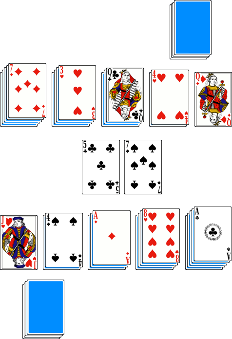

# Spit

> Source : [Spit](https://jeuxdecartes1.e-monsite.com/pages/jeux-d-appariemment/spit.html)

♦ **Matériel** : Un jeu de 52 cartes (sans Joker)

♦ **Nombre de joueurs** : À 2 joueurs

♦ **Objectif** : Se débarrasser le premier de toutes ses cartes

♦ **Nombre de cartes pour chaque joueur** : 26 cartes

♦ **Règle du jeu** : Chaque joueur dispose devant lui cinq piles d’une à cinq cartes, face cachée, et retourne, pour chacune, la carte du dessus. C’est le stock. Les onze cartes restantes, mises à l’écart, forment les ***cartes à spiter***, et ne peuvent en aucun cas être consultées par le joueur. Une fois les joueurs prêts, ils crient « ***Spit !*** » en retournant la carte du dessus (la première carte à spiter). Ces deux cartes sont placées côte à côte entre les stocks des joueurs, constituant – avec les cartes qui seront jouées dessus – les deux ***spits*** :

Désormais, les joueurs jouent simultanément, aussi vite qu’ils le souhaitent, l’objectif étant pour eux de se débarrasser de toutes les cartes de leurs stock sur les deux spits centraux. En utilisant ***une seule main ***et en ne déplaçant qu’***une seule carte ***à la fois :

1) Un joueur peut déplacer la carte visible du haut de l’une de ses cinq piles en stock sur l’un des spits. Pour être posée, sa carte doit avoir une différence de 1 avec la carte du spit. Un As peut être posé sur un Roi comme sur un 2.

2) Un joueur peut retourner la carte du haut d’une de ses cinq piles en stock après qu’une carte a été jouée sur le spit.

3) Un joueur peut déplacer une carte visible du haut de l’une de ses piles en stock dans un espace vide, sachant qu’il ne peut y avoir plus de cinq piles devant chaque joueur.

Une carte est dite « jouée » quand elle est posée sur le spit ; elle ne peut donc y être retirée. Dès lors qu’aucune des cartes visibles du stock des joueurs ne peut être jouée sur l’un des spits et qu’il n’est plus possible de retourner quelque carte que ce soit, les deux joueurs crient « ***Spit !*** » ; chacun retourne sa prochaine carte à spiter, la posant sur chaque spit. Le jeu se poursuit.

Si aucun joueur ne peut plus jouer et qu’un joueur n’a plus de cartes à spiter, alors l’autre joueur spite seul sur l’un ou l’autre spit. Son choix sera définitif : il continuera de spiter sur cette même pile chaque fois que le jeu s’en trouvera bloqué, jusqu’à ce que le stock d’un joueur se soit vidé.

Le réagencement : Une nouvelle disposition s’opère lorsque l’un des joueurs parvient à se débarrasser de toutes les cartes de son stock ou bien lorsque les deux joueurs, ayant encore des cartes en stock, sont à court de cartes à spiter. Dans l’un ou l’autre cas, les deux joueurs choisissent un spit en le frappant avec leur main, idéalement le plus petit des deux. S’ils choisissent des piles différentes, chaque joueur prend la pile qu’il a choisie ; s’ils choisissent la même pile, le joueur ayant frappé le premier s’empare de la pile choisie, l’autre joueur se rabattant sur l’autre. Les deux joueurs ajoutent au spit toutes leurs cartes constituant leur stock et leur cartes à spiter, mélangent l’ensemble et, comme au début, empilent les quinze cartes de leur stock. Quand ils sont prêts, ils crient « ***Spit !*** » et le jeu continue.

Il est fort probable qu’un joueur ait davantage de cartes à spiter que son adversaire. Par ailleurs, si un joueur a moins de quinze cartes, il ne peut compléter l’ensemble des cinq piles de son stock ; dans ce cas, le joueur dispose les cartes en cinq piles autant qu’il le peut et retourne, pour chacune, la carte du dessus. Ne pouvant plus spiter, l’autre joueur commence seul un spit qui servira pour la suite du jeu.

Lorsqu’il n’y a qu’un spit, le premier joueur à se débarrasser de son stock laisse le spit à son adversaire, qui le mélange à ses cartes en stock non encore jouées. Ainsi, lorsqu’il ne reste qu’un spit, si le joueur sans carte à spiter se débarrasse le premier de son stock, alors ce joueur n’a plus de cartes et gagne la partie.

---

♦ **Variantes** :

1) Les joueurs peuvent jouer avec un stock de quatre piles (au lieu de cinq), contenant respectivement une, deux, trois et quatre cartes.

2) Les cartes empilées sur le spit doivent être alternativement noires et rouges ; un ♠10 ne peut donc être posé que sur le ♥9, le ♦9, le ♥Valet et le ♦Valet.

3) Dans la version de David Shapp, le joueur qui se débarrasse le premier de tout son stock a le choix du spit à prendre. Il n’y a pas de frappe ; le joueur prend simplement la pile qu’il juge la plus petite. L’autre joueur prend ensuite l’autre pile (probablement plus grande).
