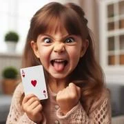

# Stortok

> Source : [Stortok](https://jeuxdecartes1.e-monsite.com/pages/jeux-d-attaque/stortok.html)

♦ **Matériel** : Un jeu de 52 cartes (sans Joker) duquel on retire les 2, les 3, les 4 et les 5

♦ **Nombre de joueurs** : Entre 2 et 5 joueurs

♦ **Objectif** : Se débarrasser de toutes ses cartes en battant la carte précédente

♦ **Nombre de cartes pour chaque joueur** : 5 cartes

♦ **Valeur des cartes, de la plus faible à la plus forte **: 6 – 7 – 8 – 9 – 10 – Valet – Dame – Roi – As

♦ **Règle du jeu** : ***Stortok*** (qui veut dire ***Gros Idiot***) est un jeu de cartes suédois. Le donneur distribue 5 cartes à chaque joueur, pose la pioche au centre et retourne une carte à côté, fondement de la pile de défausse, carte qui détermine également la couleur d’atout. Il y a deux couleurs d’atout : les ***grands atouts***, représentés par la couleur de cette première carte, et les ***petits atouts***, correspondant à l’enseigne de même couleur. De fait, si la première carte retournée est le ♣Valet, les grands atouts sont les ♣ et les petits atouts sont les ♠.

Le joueur à gauche du donneur commence en posant une carte de plus grande valeur que la première carte de la défausse. Le deuxième joueur enchaîne, et ainsi de suite, jusqu’à ce que tous les joueurs aient posé une carte. Une carte sans couleur d’atout peut être battue par un petit atout et par un grand atout ; un petit atout peut être battu par un grand atout.

1) Si, une fois le tour de jeu révolu, chaque joueur a battu la carte précédente, le dernier ayant joué choisit une carte de la pile de défausse pour entamer un nouveau tour de jeu.

2) Si ce n’est pas le cas, le joueur incapable ou refusant de battre la carte précédente doit ajouter cette carte à sa main, et le joueur suivant entame le prochain tour avec une carte de son jeu, au choix.

Chaque fois qu’un joueur jette une carte dans la défausse, il doit immédiatement en piocher une nouvelle, gardant toujours 5 cartes en main. Une fois la pioche épuisée, le jeu continue en circuit fermé. Dès lors qu’un joueur n’a plus de cartes, il est hors jeu (c’est-à-dire sauvé). Le perdant est donc le dernier joueur à avoir encore au moins une carte dans sa main : c’est le ***Stortok***.
