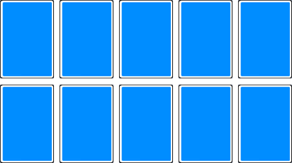

# Trash

> Source : [Trash](https://jeuxdecartes1.e-monsite.com/pages/jeux-d-appariemment/trash.html)

♦ **Matériel** : Un jeu de 52 cartes (sans Joker), deux jeux à 3 ou 4 joueurs et trois jeux à 5 ou 6 joueurs

♦ **Nombre de joueurs** : Entre 2 et 6 joueurs

♦ **Objectif** : Ordonner des cartes de l’As au 10

♦ **Nombre de cartes pour chaque joueur** : 10 cartes (en début de jeu)

♦ **Règle du jeu** : Les cartes sont mélangées et chaque joueur dispose 10 cartes devant lui, face cachée, en deux rangées de 5 ; cartes qu’il n’est pas autorisé à regarder :

Les cartes restantes forment la pioche, face cachée, au centre du jeu. L’objectif est d'être le premier joueur à agencer son jeu, cartes face visible, de l’As au 10, comme voici :

À son tour de jouer, chaque joueur tire une carte de la pioche ou de la défausse (le premier joueur, toutefois, n’a pas le choix : la pile de défausse est encore vide en début de jeu). S’il s’agit d’une carte numérique (de l’As au 10), il pose cette carte dans son jeu à l’emplacement qui lui revient (cf. disposition ci-dessus). Pour ce faire, il retire la carte face cachée qui occupe cet emplacement et la retourne, face visible. Cette carte, à son tour, est placée à son emplacement approprié, le cas échéant, en déplaçant la carte face cachée qui s’y trouve. Et ainsi de suite, jusqu’à ce que le joueur retourne une carte qui ne peut être placée : une Dame, un Roi ou toute carte numérique dont l’emplacement est déjà occupé par une carte de même valeur, face visible. Le joueur se défausse alors de la carte injouable dans une pile, face visible, à côté de la pioche. C’est au tour du joueur suivant.

1) Les ***Dames* **et les** *Rois*** achèvent automatiquement le tour du joueur.

2) Le ***Valet***, à l’image d’un Joker, peut être placé, face visible, sur n’importe quel emplacement, remplaçant ainsi la carte de son choix :

Une carte numérique dont l’emplacement est occupé par un Valet face visible peut également être disposée à cet emplacement en déplaçant le Valet qui s’y trouve ; celui-ci, à son tour, peut ensuite être déplacé vers n’importe quel autre emplacement portant une carte face cachée.

Si jamais la pioche s'épuise avant qu’un joueur ne termine son jeu, la pile de défausse, hormis la carte du haut, est mélangée pour former une nouvelle pioche.

Le gagnant est le premier joueur dont les 10 cartes apparaissent dans l’ordre, face visible. Les cartes sont ensuite mélangées et redistribuées, à ceci près qu’un joueur, après une victoire, se voit retirer un emplacement de son jeu ; seuls sont conservés les emplacements de l’As au 9 (les 10 devenant injouables). Après deux victoires, seuls les emplacements de l’As au 8 sont conservés, et ainsi de suite. Le gagnant de chaque manche entame la manche suivante. Le jeu continue jusqu’à ce qu’un joueur, n’ayant plus qu’un seul emplacement, remporte la manche en y disposant un As ou un Valet. Ce joueur gagne toute la partie.

---

♦ **Variantes** :

1) Pour un jeu plus court, le gagnant peut être le premier joueur à réduire sa disposition à un certain nombre d’emplacements (6 cartes, par exemple).

2) Les joueurs peuvent jouer un nombre fixe de manches ou pour une période de temps fixe, après quoi le joueur avec la plus petite disposition gagne.

3) Les Valets, Dames et Rois peuvent tous être utilisés comme des Jokers.
