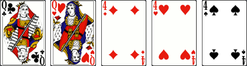

# Tres y Dos

> Source : [Tres y Dos](https://jeuxdecartes1.e-monsite.com/pages/jeux-de-pioche-defausse/tres-y-dos.html)

♦ **Matériel** : Un jeu de 52 cartes (sans Joker)

♦ **Nombre de joueurs** : Entre 2 et 7 joueurs

♦ **Objectif** : Réaliser un tres y dos (ou full house)

♦ **Nombre de cartes pour chaque joueur** : 5 cartes

♦ **Règle du jeu** : Dans ce jeu de cartes pratiqué en République dominicaine, un joueur mélange le paquet de cartes, le donne à couper au joueur à sa gauche, et distribue 5 cartes aux joueurs, une par une, dans le sens antihoraire, en commençant par le joueur à sa droite. Les cartes non distribuées forment la pioche, au centre du jeu, et la carte du haut est retournée pour constituer la pile de défausse.

Comme le jeu se joue dans le sens antihoraire, c’est le joueur à droite du donneur qui commence. À son tour, pour améliorer son jeu, chaque joueur a le choix de prendre une carte de la pioche ou de la défausse ; il doit ensuite jeter une carte de son choix, gardant toujours 5 cartes en main, son objectif étant de former le plus rapidement possible un ***tres y dos*** (ou ***full house***), c’est-à-dire une paire et un brelan :

Dès lors qu’un joueur réalise un tres y dos, il doit poser son jeu sur la table à la vue des autres joueurs. Il est déclaré gagnant ; la partie se termine. De fait, le premier joueur à poser une main gagnante remporte la partie, et ce, même si d’autres joueurs ont également, sans l’avoir remarqué, une main gagnante. Si un joueur se trompe en posant, il reprend ses cartes en main et le jeu continue. Si plusieurs joueurs posent en même temps une main gagnante (ce qui peut arriver, notamment en début de jeu), le gagnant est le joueur dont le tour serait venu en premier, en commençant par le joueur à droite du donneur et en tournant dans le sens antihoraire.

Si la pioche s’épuise, les cartes de la défausse (à l’exception de la première) sont mélangées pour former une nouvelle pioche.
